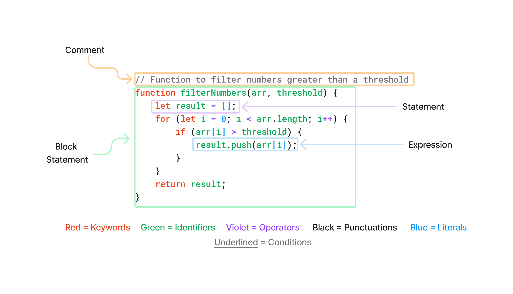

# Learn Javascript
Learn Javascript is an initiative to produce learning documentation that promotes knowledge sharing, and continuity of information. It includes comprehensive explanations and examples for learning Javascript technologies.

## 1. Terminology
Understanding programming terminology enhances the efficiency of code explanations. Familiarity with specific terms allows developers to communicate more clearly and effectively about concepts, processes, and issues in coding.
<table>
    <tr>
        <th>Terminology</th>
        <th>Definition</th>
    </tr>
    <tr>
        <td><code>Identifier</code></td>
        <td>Names used to <mark>identify</mark> variables, functions, classes, parameters, or other entities in the code.</td>
    </tr>
    <tr>
        <td><code>Keyword</code></td>
        <td>Reserved words that have a specific meaning and purpose that cannot be used as identifiers. They are used to <mark>perform specific action</mark>. For example, <code>var</code>, <code>let</code>, <code>const</code>, <code>if</code>, <code>else</code>, <code>for</code>, <code>while</code>.</td>
    </tr>
    <tr>
        <td><code>Expressions</code></td>
        <td>Combinations of values, variables, operators, and functions that are evaluated to <mark>produce a value</mark>. Examples include arithmetic expressions (<code>5 + 3</code>), string concatenation (<code>"Hello" + " World"</code>), and function calls (<code>Math.max(10, 20)</code>).</td>
    </tr>
    <tr>
        <td><code>Literals</code></td>
        <td><mark>Fixed values directly written into the code.</mark> They represent constant values that are not variables or expressions. For example, string literals (<code>"Hello"</code>), number literals (<code>42</code>), boolean literals (<code>true</code>, <code>false</code>), null literal (<code>null</code>), and array literals (<code>[1, 2, 3]</code>).</td>
    </tr>
    <tr>
        <td><code>Statements</code></td>
        <td>Single line code that <mark>ends with semi-colon</mark> <code>;</code> that performs instructions. Examples include <mark>variable declarations</mark> (<code>let x = 10;</code>), <mark>single-line function declarations</mark> (<code>greet = () => ...;</code>), and <mark>function calls</mark> <code>greet();</code></td>
    </tr>
    <tr>
        <td><code>Block Statements</code></td>
        <td>Block of code <mark>enclosed in curly braces</mark> <code>{}</code> that allows multiple statements to be treated as a single statement. Examples include <mark>conditional statements</mark> (<code>if (x > 5) { ... }</code>), <mark>loops</mark> (<code>for (let i = 0; i < 5; i++) { ... }</code>), and <mark>function declarations</mark> (<code>function greet() { ... }</code>).</td>
    </tr>
    <tr>
        <td><code>Operator</code></td>
        <td>Symbols or keywords used to <mark>perform operations on operands</mark> (values and variables). Examples include arithmetic operators (<code>+</code>, <code>-</code>), comparison operators (<code>==</code>, <code>!=</code>), logical operators (<code>&&</code>, <code>||</code>), and assignment operators (<code>=</code>, <code>+=</code>).</td>
    </tr>
    <tr>
        <td><code>Punctuation / Syntax Element</code></td>
        <td>Symbols used to <mark>structure and organize code</mark>. Examples include semicolons (<code>;</code>) to terminate statements, curly braces (<code>{}</code>) to define code blocks, and parentheses (<code>()</code>) for grouping expressions and function calls.</td>
    </tr>
    <tr>
        <td><code>Condition</code></td>
        <td>A condition is an expression that evaluates to a boolean value, either <code>true</code> or <code>false</code>. It is used to control the flow of execution in control structures like <code>if</code> statements, <code>while</code> loops, and <code>for</code> loops.</td>
    </tr>
    <tr>
        <td><code>Parameter</code></td>
        <td>A parameter is a variable used in a function definition to <mark>represent the value that will be passed to the function when it is called.</mark> Parameters allow functions to accept input values and perform operations based on those inputs.
        </td>
    </tr>
    <tr>
        <td><code>Argument</code></td>
        <td>An <mark>argument is the actual value that is passed to a function when it is called.</mark> Arguments are the real data that the function processes, and they correspond to the parameters defined in the function.
        </td>
    </tr>
</table>
 

### 1.1. Code Description
Here is a detailed explanation of the following code block:

 

Explanation of the code:

<code>filterNumbers</code> is a function that takes in 2 parameters as input which is <code>arr</code> and <code>threshold</code>. Firstly, it defines an empty array identified as <code>results</code>. After that, the program iterates through the array using the <code>for</code> keyword. Inside the loop, it checks if each element in the array is greater than the <code>threshold</code> using a condition. If the condition is true, the element is added to the <code>results</code> array. Finally, the function returns the <code>results</code> array.
 

<table>
    <tr>
        <th>Code</th>
        <th>Terminology</th>
        <th>Description</th>
    </tr>
    <tr>
        <td>
            <code>// Function to filter numbers greater than a threshold</code>
        </td>
        <td>Comment</td>
        <td>Non-executable code that allows developers to add notes.</td>
    </tr>
    <tr>
        <td>
            <code>function</code>,
            <code>let</code>,
            <code>for</code>,
            <code>return</code>
        </td>
        <td>Keywords</td>
        <td>Used to perform a specific operations such as defining variables, looping, and function returns.</td>
    </tr>
    <tr>
        <td>
            <code>filterNumbers</code>,
            <code>arr</code>,
            <code>threshold</code>,
            <code>result</code>,
            <code>i</code>,
            <code>length</code>,
            <code>push</code>
        </td>
        <td>Identifiers</td>
        <td>User-defined names to identify functions, variables, and parameters.</td>
    </tr>
    <tr>
        <td>
            <code>=</code>,
            <code>></code>,
            <code>++</code>,
            <code><</code>
        </td>
        <td>Operators</td>
        <td>Symbols that are used to perform operations on operands.</td>
    </tr>
    <tr>
        <td>
            <code>()</code>,
            <code>{}</code>,
            <code>;</code>
        </td>
        <td>Punctuations</td>
        <td>Symbols used to structure and organize codes.</td>
    </tr>
    <tr>
        <td>
            <code>0</code>,
            <code>[]</code>,
            <code>[i]</code>
        </td>
        <td>Literals</td>
        <td>These are fixed values with defined data types.
         
         
        For example,
            <ul>
                <li>
                    <code>0</code> represents a number with value 0.
                </li>
                <li>
                    <code>[]</code> represents an empty string.
                </li>
                <li>
                    <code>[i]</code> represents an array containing the value of <code>i</code>.
                </li>
            </ul>
        </td>
    </tr>
    <tr>
        <td>
            <code>arr.length</code>,
             
            <code>result.push(arr[i])</code>,
             
            <code>i++</code>
        </td>
        <td>Expression</td>
        <td>A combination of variables, operators, and functions to generate a value. <mark>These expressions returns number and boolean values.</mark>
        </td>
    </tr>
    <tr>
        <td>
            <code>let result = [];</code>,
             
            <code>let i = 0;</code>,
             
            <code>result.push(arr[i]);</code>,
             
            <code>return result;</code>
        </td>
        <td>Statement</td>
        <td>Statement refers to a single line of code consists of keywords to perform a single action such as variable declaration, function calls, assignments. Normally ends with a semi-colon <code>;</code>.</mark>
        </td>
    </tr>
    <tr>
        <td>
            <code>function filterNumber (arr, threshold){...}</code>,
             
             
            <code>for (let i = 0; i < arr.length; i++){...}</code>,
             
             
            <code>if (arr[i] > threshold) {...}</code>
        </td>
        <td>Block Statement</td>
        <td>Block statement refers to a group of statement enclosed in curly braces <code>{}</code>, typically used in control flow keywords like <code>if</code>, <code>for</code>, <code>while</code>, <code>function</code>.
        </td>
    </tr>
    <tr>
        <td>
            <code>arr[i] > threshold</code>,
             
            <code>i < arr.length</code>
        </td>
        <td>Condition</td>
        <td>These are the conditions that need to be met for controlling the program flow often used in conditional statements and looping.
        </td>
    </tr>
</table>